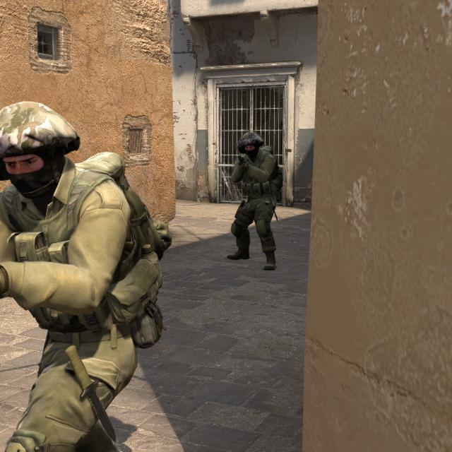
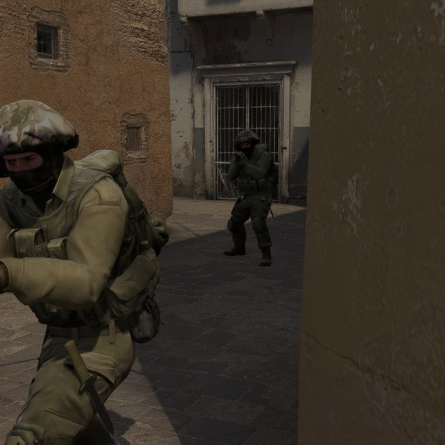
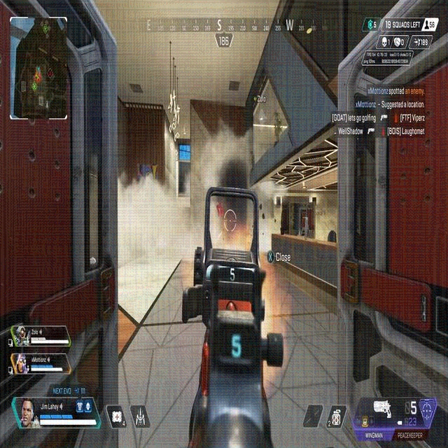

# Outsmarting AI Cheats: Gradient-Based Game Security Using Adversarial Attacks

Official repository for **"Outsmarting AI Cheats: Gradient-Based Game Security Using Adversarial Attacks"**, published in *High-Confidence Computing*.

[](https://github.com/asergiu-ubb/ai-cheats-adversarial)
[](https://github.com/asergiu-ubb/ai-cheats-adversarial)

---

## 📖 Abstract

AI-driven visual cheats in competitive gaming—such as aimbots built on real-time object detectors—pose a growing threat to fair play that current anti-cheat systems fail to reliably address. This article presents a gradient-based adversarial attack methodology that neutralizes such cheats by generating Universal Adversarial Perturbations (UAPs) to suppress character detection without visibly degrading the game image. To achieve this, we first introduce a novel multi-game benchmark dataset of 10,000 annotated images (from CS2, Rust, Marvel Rivals, and Apex) to enable standardized evaluation. Building on this, we propose a UAP generation pipeline that utilizes Momentum Integrated Gradient (MIG) initialization to improve convergence and transferability across heterogeneous detection architectures. We further enhance this methodology with directional noise refinement and gradient filtering, which simultaneously improve attack effectiveness and preserve perceptual image quality. Finally, we introduce a zero-knowledge black-box perturbation search that operates without access to proxy models, relying solely on visual feedback. Extensive validation against real-world commercial cheats demonstrates that our approaches consistently outperform the existing Invisibility Cloak framework in both transferability and image fidelity.

---

## 🎮 Characters Dataset

The multi-game benchmark dataset containing **10,000 annotated images** across CS2, Rust, Marvel Rivals, and Apex is hosted at:
👉 **[Dataset Repository & Project Page](https://github.com/asergiu-ubb/ai-cheats-adversarial)**

Each game contributes approximately 2,500 samples captured under diverse environmental conditions (actions, times of day, indoor/outdoor contexts) annotated with bounding boxes around visible game characters in YOLO format.

---

## 🛠️ Repository Structure

```directory
github_release/
├── assets/                    # Visual assets for documentation
├── checkpoints/               # Trained proxy detector weights (.pt)
├── experiments/               # Training dataset configuration YAMLs
├── image_quality/             # SSIM/PSNR evaluation scripts
├── masks/                     # Pre-computed universal perturbations
└── utils/                     # Metric calculation utilities
```

---

## 🚀 Getting Started

### 1. Installation
Clone the repository and install the dependencies:
```bash
pip install -r requirements.txt
```
Make sure you have PyTorch with GPU support and the `ultralytics` package installed.

### 2. Training Proxy Detectors
We train 8 object detectors to mimic AimBots. Configuration files are provided under `experiments/`. Run the scripts to train models:
```bash
# Train YOLOv8
python train_yolov8.py

# Train YOLOv11
python train_yolov11.py

# Train RT-DETR
python train_rtDETR.py
```
> [!NOTE]
> Update the paths in `experiments/*.yaml` to point to your local dataset directories.

### 3. Generating Universal Adversarial Perturbations (UAPs) via MIG
To generate UAPs using Momentum Integrated Gradient (MIG) initialization:
```bash
python train_mig.py --path /path/to/dataset/train --eval_root_path /path/to/dataset/test
```
Or run the main experiment pipeline to compare with Invisibility Cloak:
```bash
python main_all_proxy.py \
    --train-model checkpoints/yolo8n_640_all.pt \
    --train-datasets /path/to/train \
    --test-datasets /path/to/test \
    --initial-perturbation MIG \
    --perturbation-mode get_adv_sign \
    --batch-size 64 \
    --save-perturbation
```

### 4. Zero-Knowledge Black-Box Search
In fully opaque settings where no proxy models are available, run the offline random search to discover successful anti-cheat masks:
```bash
python adversarial_search.py
```

---

## 📊 Summary of Results

### 1. Defense Success Rate (DSR) Comparison
*Averaged across all evaluated models using YOLOv8n as the proxy model.*

| Method | Average DSR (%) |
| :--- | :---: |
| Invisibility Cloak | $33.27\%$ |
| **Ours (MIG + Gradient Filtering)** | **$57.56\%$** |

### 2. Transferability mAP Comparison ($\epsilon=8/255$)
*Lower mAP indicates stronger defense success in suppressing aimbot target detection.*

| Proxy Model | Clean Baseline mAP | Adversarial mAP (Invisibility Cloak) | Adversarial mAP (Ours) |
| :--- | :---: | :---: | :---: |
| **YOLOv8n** | 0.8945 | 0.6091 | **0.4916** |
| **YOLOv11n** | 0.9021 | 0.6136 | **0.5092** |
| **YOLOv5n** | 0.9021 | 0.6113 | **0.4944** |
| **YOLOv11s** | 0.9119 | 0.6115 | **0.5103** |
| **YOLOv8s** | 0.9052 | 0.6073 | **0.4837** |
| **YOLOv5s** | 0.9054 | 0.6102 | **0.4782** |
| **RT-DETR-X** | 0.8857 | 0.7026 | **0.6281** |
| **RT-DETR-L** | 0.8882 | 0.7107 | **0.6322** |

---

## 🖼️ Visualizations

### Momentum Integrated Gradients (MIG) Initialization
Our method uses MIG to aggregate gradient information over interpolations from a baseline image:

| Baseline ($j=0$) | Scaled ($j=10$) | Scaled ($j=20$) |
| :---: | :---: | :---: |
|  |  |  |

### Perceptual Image Quality Comparison
By applying directional sign refinement and gradient filtering, our method preserves image quality and avoids color degradation compared to Invisibility Cloak:

| Invisibility Cloak Perturbation | Our Perturbed Image (Ours) |
| :---: | :---: |
|  |  |

---

## 📧 Citation

```bibtex
@article{pamint2026outsmarting,
  title={Outsmarting AI Cheats: Gradient-Based Game Security Using Adversarial Attacks},
  author={Pamint, Andrei-Florin and Ileni, Tudor Alexandru and Darabant, Adrian Sergiu and Maduta, Adrian Pavel},
  journal={High-Confidence Computing},
  year={2026},
  publisher={Elsevier}
}
```
